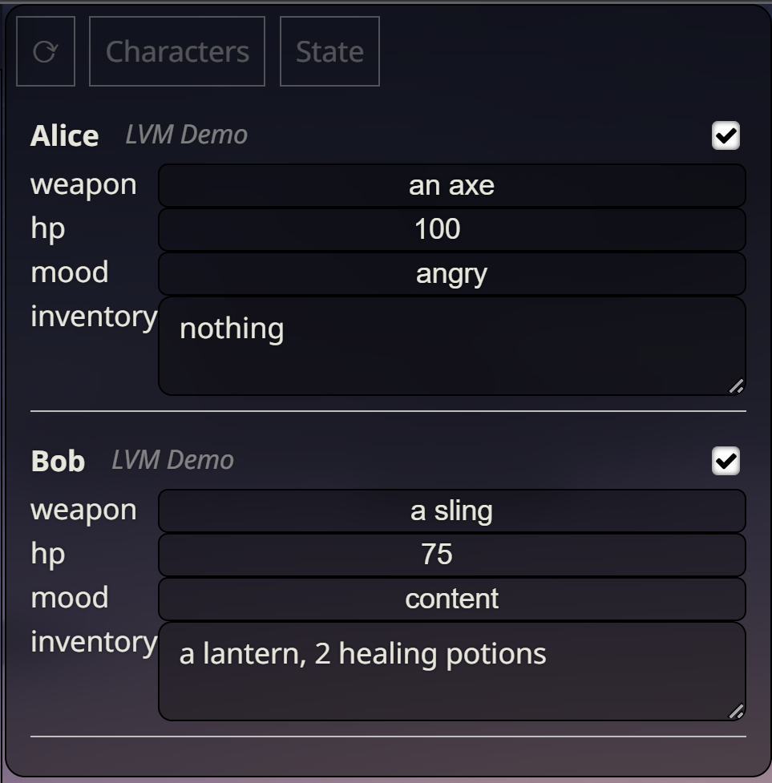

# Lore Variable Manager

Variable manager for lorebook / world info entries.

Let's you quickly change aspects of lorebook entries and disable / enable individual entries.




## ⚠️ **WARNING** ⚠️

**Consider this an alpha version / proof of concept.**

The code is rather shoddy, as I was not sure where I was going with this when I started and made everything up along the way until it kinda did what I was looking for.

I am currently using this to manage a couple of character sheets and it works fine most of the time, however, from time to time after (seemingly successfully) changing a value, I would a little later find it to have reset to its previous value, so keep an eye on that.

To show / hide the panel you have to go into the extension settings.

The panel is fixed in its position, even if you enable MovingUI.

Only entries from the globally active lorebooks are shown. If a lorebook is only active because it is linked to a character, the extension will not pick it up.

The current values of the variables are added to the end of the Memo/Note field (`###lv-values...`). This often leads to that field having more than the 2000 characters allowed in its input box. However, the character limit only seems to be on the UI. So far, even longer texts were still correctly saved in my testing.  
If you want to make changes to an entry's Memo/Note field that is already above the character limit, you may have to either remove everything after (and including) `###lv-values`, or edit the textarea to allow longer inputs: right-click on the textarea > inspect > double-click on maxlength and enter a larger number.


## Installation

Use ST's inbuilt extension installer.


## Usage

Extensions > Lore Variables > Display Variable Panel (to hide or show the panel)

- Create a new Lorebook entry (or edit an existing one), enter your keywords but leave the `Content` field blank (it will be overwritten by this extension).

- Instead, write a line in the `Memo/Note` field with just `#lv:TAB_NAME`, (replace `TAB_NAME` with a category / group for this entry, e.g. "Characters") write the content you would usually put into the `Content` field on the next lines. Replace any part of the text that you want to be able to change on the fly with a placeholder like this: `<NAME:TYPE>` or `<NAME:TYPE=DEFAULT_VALUE>`; replace `NAME` with an appropriate name for the variable, `TYPE` with the type of variable (currently only `i` for numbers / integers, `S` for short text and `ss` for longer text), and `DEFAULT_VALUE` with what you want the variable's initial value to be.

- Click on the refresh button [⟳] to update the Lore Variable panel.

- Start chatting and update the lorebook entries through the Lore Variables panel.

- Click on one of the categories next to the refresh button to show that category's entries, click again to collapse the entry list again.

- Click on one of the entry names to collapse / uncollapse that entry.

- Click the checkbox next to an entry name to disable / enable that entry in the lorebook.


## Example

Memo/Note:

```
#lv:Characters
Character(Alice)[dwarf warrior armed with <weapon:s=an axe>, her health is at <hp:i=100>%, her mood is <mood:s=angry>, in her backpack she has: (<inventory:ss=nothing>)]
```

Will result in Content:

```
Character(Alice)[dwarf warrior armed with an axe, her health is at 100%, her mood is angry, in her backpack she has: (nothing)]
```


## Requirements

SillyTavern version >=1.10.4